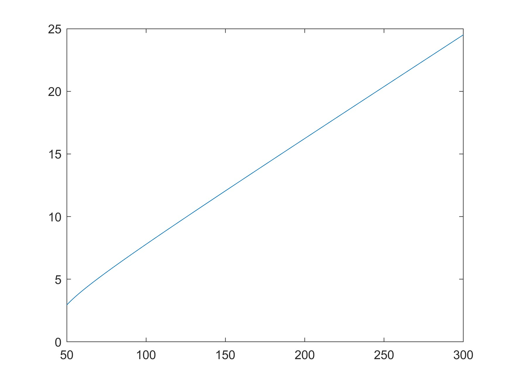

# Project 2: Van Der Waals Equation

Author: WangHaoZhe (522072910008)  
Submit Date: 2023/5/6

## Main Code

**You can run this code section by section to test my each question.**

You can also find my full code (so you don't have to copy my programs from this pdf) and the raw file (in Markdown) of this pdf on my Github:
github.com/WangHaoZhe/Project2_VanDerWaalsEquation

```Matlab
% Project 2: Van Der Waals Equation
% Author: WangHaoZhe 522072910008
% Create Date: 2023/5/6
% Submit Date: 2023/5/6

%% Parameters
a = 3.592;
b = 0.04267;
R = 0.082054;
T = 298;
P = 1;
error = 2^(-16);
max_step = 100;

%% NewtonMethod
V = NewtonMethod(P,a,b,R,T,error,max_step);

%% Fixpoint
V = Fixpoint(P,a,b,R,T,error,max_step);

%% Plot V-T
t = linspace(50,300,100);
V = [];
for i=1:100
    V(end+1) = NewtonMethod(P,a,b,R,t(i),error,max_step);
end
plot(t,V);
```

## Question 1: Iteration

### Code

#### File Name: NewtonFunction.m

```Matlab
function y = NewtonFunction(x,P,a,b,R,T)
syms V;
f = V - ((R * T * V^2 / (P * V^2 +a) + b - V)./diff(R * T * V^2 / (P * V^2 +a) + b - V, V));
y = subs(f,x);
end
```

#### File Name: NewtonMethod.m

```Matlab
function x = NewtonMethod(P,a,b,R,T,error,max_step)
    V_ini = (R * T) / P;
    step = 0;
    x_rev = V_ini;
    x_new = V_ini;
    
    while step < max_step
        x_old = x_new;
        x_new = NewtonFunction(x_old,P,a,b,R,T);
        x_rev(end + 1) = x_new;
        if    abs(x_new - x_old)<error
              x = x_rev(step+2);
              break
        end
        step = step + 1;
    end
end
```

### Result

V = 24.3474899453862

#### File Name: Fixpoint.m

```Matlab
function x = Fixpoint(P,a,b,R,T,error,max_step)
    V_ini = (R * T) / P;
    step = 0;
    x_rev = V_ini;
    x_new = V_ini;
    f = @(V)R * T * V^2 / (P * V^2 +a) + b;

    while step < max_step
        x_old = x_new;
        x_new = f(x_old);    
        x_rev(end + 1) = x_new;
        if abs(x_new - x_old) < error
            x = x_rev(step+2);
            break
        end
        step = step + 1;
    end
end
```

### Result

V = 24.3474901260847

## Question 2: Plot V-T

### Result



V-T is not linear when T<70. Therefore, the Ideal Gas Law only applies to the case where T<70.

*The iteration Method does not convergence when T<46.2.